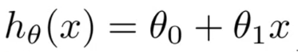
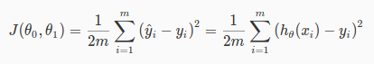
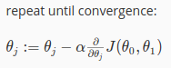
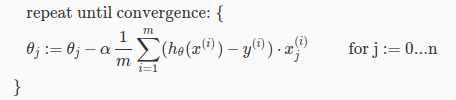

# Week 1 keynote

## Definitions

**Machine Learning:** gives computer the ability to learn without explicitly programmed.  

**Machine learning algorithms**  
  - Supervised learning:  
    - Training data includes both sample input and output.  
    - Regression: for output values in continuous space.  
    - Classification: for output values in discrete space.  
  - Unsupervised learning:  
    - Training data includes input only.  
    - The machine will detect the relationship between inputs, and group them.  

**Training data**  
The machine first learns from the history data, then uses those knowledge to make
prediction.  
E.g. the data of Housing Price. Given the dataset with these information:  
  - House's number of rooms (input or feature 1)  
  - House's area (input or feature 2)  
  - House's price (output)  

## Model

Model is a function to take input `x` and calculate (predict) output `y`.  

Also known as **hypothesis function**, denoted by `h(x)`, so `y = h(x)`.  
E.g. this is a simple linear model:  
  

### Theta - the parameter  
Theta is the parameter of model. It is all the machine needs to make prediction.  
  - At first, before training, theta is far from perfect. Model predict very bad and inaccurate.  
  - During training, with sample input/output data, the training algorithms repeatedly
tune theta into final value.  

**Finding model = finding theta**  

**How to find theta**  
=> We try and try and try difference of parameters, until found the best one.  

**How to perform trying?**  
=> By various of algorithms: Gradient Descent,...

**How to know if the parameter is the best?**  
=> Feed all training data's input to current model to get the predicted output.
Compare predicted output to training data's output, to see how good the model is.  
For convenience to compare predicted vs real output, we use **Cost function**.

### Cost function  
Cost function is a function of theta for model with 1 feature `theta1`:  
  
It describes the average difference between predicted output and real
output in the training data.

The smaller difference, the better model.

The smallest difference, the best model.

So if this cost function is minimum, we found the best model (and best theta).

**How to find where cost function is min?**  
=> By tool: Gradient Descent.

## Gradient Descent

  
`theta_j` is parameter for feature `j`.  
`alpha` is learning rate - how fast we want to find final value theta. Careful if too fast.  
The derivative part is to find the changing rate of Cost function `J`.  

  - In short, we slowly change `theta` toward the value where we hardly change further.  
  - At each iteration, the `theta` value is changed so that in the next iteration, the
changing rate of `J` (derivative) becomes smaller and smaller.  
  - Eventually we get to the point: Converged point - where we found the final value of `theta`.

Now we break the derivative of `J`:  
  

For multi features:  
  
