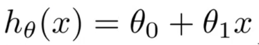
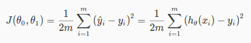

# Week 1: Linear Regression

## Model

Model is a function to take input `x` and calculate (predict) output `y`.  

Also known as **hypothesis function**, denoted by `h(x)`, so `y = h(x)`.  
E.g. this is a simple linear model:  

Hypothesis funtion for `n` features:  

Rewrite as vector:  

## Theta - the parameter

Theta is the parameter of model. It is all the machine needs to make prediction.

- At first, before training, theta is far from perfect. Model predict very bad and inaccurate.
- During training, with sample input/output data, the training algorithms repeatedly tune theta into final value.

So, **finding model = finding theta**.  
And there are 2 ways to find theta:

- We keep trying difference of parameters, until found the best one. One method is Gradient Descent.
- We calculate at once, like using Normal Equation.

**Using Gradient Descent, how to know if the parameter is the best?**

=> Feed all training data's input to current model to get the predicted output.
Compare predicted output to training data's output, to see how good the model is.  
For convenience to compare predicted vs real output, we use **Cost function**.

## Cost function

Cost function is the difference between predictions and real output value.  
The smaller difference, the better model.  
The smallest difference, the best model.

There are many functions can be used as cost function. For Linear Regression problem, we choose **Mean Squared Error**:  

It describes the average difference between predicted output and real output in the training data.

### Why MSE

When squaring the error, larger errors will be magnified more. It is useful when large errors are undesirable, and we want to detect and penaltilize those large errors.

[This article](https://medium.com/human-in-a-machine-world/mae-and-rmse-which-metric-is-better-e60ac3bde13d) compares the effect of squaring the error.

Beside, squared error is easiest to minimize (find min point) by taking derivative.

So, how we minimize the cost function? By mathematic tool - Gradient Descent.

## Gradient Descent

  
`theta_j` is parameter for feature `j`.  
`alpha` is learning rate - how fast we want to find final value theta. Careful if too fast.  
The derivative part is to find the changing rate of Cost function `J`.  

- In short, we slowly change `theta` toward the value where we hardly change further.
- At each iteration, the `theta` value is changed so that in the next iteration, the changing rate of `J` (derivative) becomes smaller and smaller.
- Eventually we get to the point: Converged point - where we found the final value of `theta`.

Now we break the derivative of `J`:  
  
This derivative is called gradient.

So, the final algorithm of Gradient Descent:  
  
