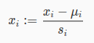
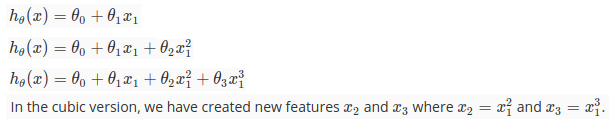
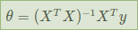

# Week 2 keynote

## Gradient Descent - Feature scaling

Using Gradient Descent, we should scale all features into normalized ranges. e.g.
`-1 <= x <= 1` or `-0.5 <= x <= 0.5`  

Benefits: Speed up gradient descent. This is because θ will descend quickly on small ranges (x1) and slowly on large ranges (x2), and so will oscillate inefficiently down to the optimum when the variables are very uneven.

There are 2 techniques:

- Mean normalization: subtract input by input's average
- Feature scaling: divide input by input's range

Combined:  

- `u_i` is average of inputs of feature i
- `s_i` is range of inputs of feature i, can also be standard deviation

## Polynomial Regression

We learnt about Linear Model hypothesis function.  

There are Non-linear model, such as Quadratic, Cubic or any other form. We can use them as long as they can fit our data better:  
  

### Feature cross

We can also combine multiple features into one new feature.

For example, we can combine `x_1` and `x_2` into a new feature `x_3` by taking `x_1 ⋅ x_2`.

## Normal Equation

This is the method to calculate `theta` **instantly**, without iteratively trying various value like Gradient Descent.

This is formula:  
  

How to derive that equation:

- [Using matrix calculus](https://ayearofai.com/rohan-3-deriving-the-normal-equation-using-matrix-calculus-1a1b16f65dda)
- [Another](https://eli.thegreenplace.net/2014/derivation-of-the-normal-equation-for-linear-regression)
- [And another](https://eli.thegreenplace.net/2015/the-normal-equation-and-matrix-calculus/)

Comparation  
Gradient Descent|Normal Equation
---|---
Need to choose alpha|No need to choose alpha
Needs many iterations|No need to iterate
O(kn^2)|O(n^3) need to calculate inverse of X^T x X
Works well when n is large|Slow if n is very large
