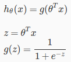
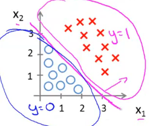
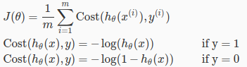
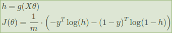
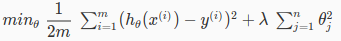

# Week 3 keynote

## Classification

Similar to regression, but output is discrete values.  

**Binary Classification:** classification that output can take only 2 values: 0 or 1.  

## Model representation

Recall our last model function: `h(x) =  theta_transpose * x`  
This function outputs arbitrary value, infinity bounded  

Our new model for Classification requires limited output: `0 <= h(x) <= 1`  

So we need a new function, that transform old hypothesis function into new.  
There are many function satisfy that, we use **Sigmoid function**:  
  
Plot of g(z):  
  

Apply to our old hypothesis:  
  

## Decision Boundary

Transform probility into discrete values 0, 1:  
```
h(z) >= 0.5  =>  y = 1
h(z) < 0.5   =>  y = 0
```
or  
```
h(z) >= 0.5  <=  z >= 0
h(z) < 0.5   <=  z < 0
```
or  
```
h(z) >= 0.5  <=  theta_transpose * x >= 0
h(z) < 0.5   <=  theta_transpose * x < 0
```
Combine them together:  
  

From here, we can plot the Decision Boundary.  
Example, for `h(x) = g(-3 + x1 + x2)` (theta = [-3 1 1]):  
  

## Cost function

Our Logistic Regression Cost function:  
  

### Intuition explain

Cost is the difference between `h` and `y`, so: cost decreases as `h` is approaching `y`.  
That's where `log` function best suited. Let's plot J over h:  

When `y = 1`: Cost decreases as `h` approaching 1. Cost increases as `h` approaching 0.  


When `y = 0`, cost decreases as `h` approaching 0. Cost increases as `h` approaching 1.  


### Simplified Cost function

Combine 2 conditions `y = 0` and `y = 1`, we get single statement:  


Or full version:  


Vectorized:  


**Gradient Descent can be applied as before**


## Multiclass Classification

Singleclass: `y = {0,1}`  
Multiclass:  `y = {0,1..n}`  

### How to solve?
  - Step 1: Choose 1 class, e.g. class 0  
  - Step 2: Merge all remain classes into 1 new class. Problem becomes singleclass  
  - Step 3: Solve problem using singleclass method  

## Overfitting problem

If our model perfectly matches training dataset, the prediction for future input value
that not in training dataset could be bad.  
Overfitting: too much fit the training dataset.  

In the other hand: Underfitting.

### How to deal with it
  - Reduce the number of features  
  - Regularization: Keep all the features, but reduce the magnitude of parameters (theta)  

### Regularization

We modify cost function:  


We add `lambda` to magnify the effect of some features `theta`.  
These features will become big contributers to the cost.  
When optimizing, Gradient Descent will try to reduce their effect, by decreasing their
`theta`.