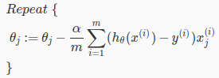

# Week 3: Classification

## Classification

Similar to regression, but output is discrete values.  

**Binary Classification:** classification that output can take only 2 values: 0 or 1.  

## Model representation

Recall our last model function: `h(x) =  theta' * x`  
This function outputs arbitrary value, infinity bounded  

Our new model for Classification requires limited output: `0 <= h(x) <= 1`  
So we need a new hypothesis function to represent our model.

There are many functions can satisfy that. For example: step function, sigmoid...

### Step function

For convenience to visulize, we wrap our old hypothesis function:

```html
let z = h(x)
means z = theta' * x
```

The formula of step function:

```html
g(z) = 1  if z > 0
g(z) = 0  if z < 0
```


### Sigmoid function

The formula of sigmoid function:  


Apply to our old hypothesis:  


### Which function to choose

You can represent the model by any functions that are bounded between 0 and 1. Step function works perfectly fine, so does sigmoid function.

But [Sigmoid is so popular](https://stats.stackexchange.com/questions/162988/why-sigmoid-function-instead-of-anything-else). So we will use it to represent our model from now on.

## Decision Boundary

An simple classification problem:  


Here we see a line separates our dataset (called decision boundary), which can be formulated as:

```html
x2 = -x1 + 3
or
-3 + x1 + x2 = 0
```

so, our hypothesis can be:

```html
Predict as RED    if   -3 + x1 + x2 > 0
Predict as BLUE   if   -3 + x1 + x2 < 0
```

or

```html
h = 1    if   -3 + x1 + x2 > 0
h = 0    if   -3 + x1 + x2 < 0
```

Check this term `-3 + x1 + x2`. Does it looks familiar to something? Yes, it is:  
`theta0 + theta1 * x1 + theta2 * x2`  
with `theta0 = -3`, `theta1 = 1`, `theta2 = 1`

or more generic: `theta' * x` with `theta = [-3 1 1]`

So now we can say:  
  

## Cost function

Can we use our old MSE function as in Linear Regression? Like this:  


But notice the difference here: we changed the `h` function from linear (in Linear Regression) into sigmoid function, which is non-linear. If we plot the above cost function, it seems to be "non-convex", and introduces many local optima.

So instead, we use a clever cost function:  


### Intuition explain

Cost is the difference between `h` and `y`, so: cost decreases as `h` is approaching `y`.  
That's where `log` function best suited. Let's plot J over h:  

When `y = 1`: Cost decreases as `h` approaching 1. Cost increases as `h` approaching 0.  


When `y = 0`, cost decreases as `h` approaching 0. Cost increases as `h` approaching 1.  


This cost function is convex!

### Simplified Cost function

Combine 2 conditions `y = 0` and `y = 1`, we get single statement:  


Or full version:  


Vectorized:  


### Gradient Descent

Gradient Descent can be applied as before:  


We just need to find the gradient of the cost function by [taking derivative of the cost function `J`](https://stats.stackexchange.com/questions/278771/how-is-the-cost-function-from-logistic-regression-derivated):  


Surprisingly, it looks very similar to Linear Regression gradient! How different cost functions have the same derivatives?

The main difference here is `h`, which is Linear vs Sigmoid.

We can now get full Gradient Descent algorithm:  


## Multiclass Classification

Singleclass: `y = {0,1}`  
Multiclass:  `y = {0,1..n}`  

### How to solve? Use one-vs-all

- Step 1: Choose 1 class, e.g. class 0  
- Step 2: Merge all remain classes into 1 new class. Problem becomes singleclass  
- Step 3: Solve problem using singleclass method  
