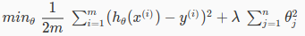

# Week 3: Regularization

## Overfitting problem

If our model perfectly matches training dataset, the prediction for future input value
that not in training dataset could be bad.  
Overfitting: too much fit the training dataset.  

In the other hand: Underfitting.

### How to deal with it

- Reduce the number of features  
- Regularization: Keep all the features, but reduce the magnitude of parameters (theta)  

### Regularization

We modify cost function:  

We add `lambda` to magnify the effect of some features `theta`.  
These features will become big contributers to the cost.  
When optimizing, Gradient Descent will try to reduce their effect, by decreasing their
`theta`.