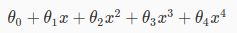
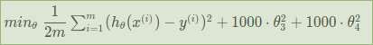

# Week 3: Regularization

## Underfitting and Overfitting

If our model perfectly matches training dataset, the prediction for future input value that not in training dataset could be bad.  

The 3rd plot represents Overfitting: too much fit the training dataset.  
The 1st plot represents Underfitting: too little fit the training dataset.

For example, suppose we have a model:  

This model has high degree features: `x^2`, `x^3` and `x^4`.  
That makes the model too smooth and fit the dataset too well, so introducing overfitting.

### How to fix overfitting

We reduce the smoothness of that model. And there are 2 methods:

- Reduce the number of features i.e. remove some high degree features, e.g. `x^3` and `x^4`
- Or apply Regularization: reduce the effect of some features

## Regularization

Here we want to reduce the effect of some high degree features like `x^3` and `x^4`, by **reducing the weights** of those features. That means we want to minimizes `theta3` and `theta4`.

An idea is modify cost function like this:  

We've added two extra terms at the end: `1000 theta3^2 + 1000 theta4^2`  
These terms add a big amount of cost to total cost.  
So to minimize the cost function, we have to reduce those `theta` a lot, make them closer to zero.

In generic, we add regularization all features:  
  
`lambda` is regularization parameter. It determines how much the costs of our theta parameters are inflated.

### Why regularize all features

Yeah, why not just regularize `x^3` and `x^4` in the example?

See [this answer](https://stats.stackexchange.com/questions/230013/why-regularize-all-parameters-in-the-same-way).

One reason is we don't know which features are more important than others, and needed to be regularized more than others.

Another reason is we let the machine do the work.