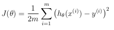
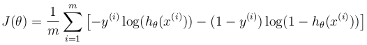
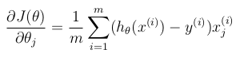

# Week 3 - Self build a Classifier

## Classifier 1 - Use Gradient Descent instead of fminunc

For this classifier, we keep the same configuration as ex2:

- Hypothesis function: sigmoid
- Cost function: log

But instead of using `fminunc`, we use Gradient Descent to optimizer.  
It takes longer run time, but the result seems good.

The code base is refactored a bit, to add more flexibility to test various configurations:

- Hypothesis and Cost function are now abstract.
- gradientDescent is now generic. It accepts various implementations of Hypothesis and Cost function as parameters.
- If you want to use new hypothesis, just implement it and pass the function to gradientDescent. The same applied to Cost function.

For this `classifier1`, we use:

- Hypothesis: `hypothesisSigmoid.m`
- Cost function: `costAndGradientLog.m`

We got `theta` = [-17.628695 0.146062 0.140513]

## Classifier 2 - Use step function instead of sigmoid

Now, instead of using sigmoid as hypothesis function, we use step function:

- Hypothesis: `hypothesisStep.m`
- Cost function: `costAndGradientLog.m`

We got `theta` = [-18.618330 0.155755 0.152980]

There is not much difference to when using sigmoid.

## Classifier 3 - Use MSE as cost function

Now, instead of Log, we use MSE as cost function:

- Hypothesis: `hypothesisStep.m`
- Cost function: `costAndGradientMSE.m`

We got `theta` = [-18.618330 0.155755 0.152980]

It's similar to classifier 2! What? It's because the gradient formula is not changed for both these cost function:

MSE 

Log 

Same gradient 
