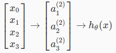
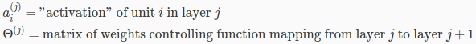
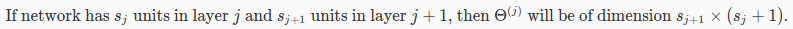
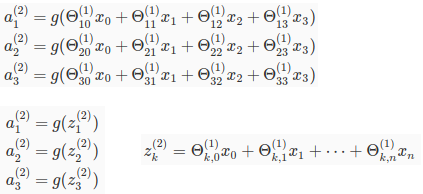
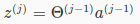
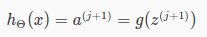

# Recall what we learnt so far

## Regression

Hypothesis function `h(x)` can be **linear, quadratic, cubic or any degree**.  
For some problems, **increase the function degree** can make model more fitting, accurate.  

Cost function `J(theta)` has fixed degree. We can represent Cost function the same for 
all problems.  

Gradient Descent is method to find `theta`, so that Cost function `J(theta)` is minimum.  
One other method is Normal Equation.  

In short, Hypothesis function could varies alot, but Cost function and Gradient Descent stay the same.  

**Reduce degree, make it linear:**  
We can always reduce degree, by introduce new feature: `x + x^2` become `x1 + x2`, with `x1 = x` and `x2 = x^2`  
So all problems could be represented in linear form.

## Classification

For discrete output set, `h(x)` need to be limited into [0,1]. Use sigmoid function for that.  

For multiclass, use one-vs-all method.  

# Neural network

For non-linear hypothesis, we can transform into linear by introducing new features.  
The more complex problem, the more features need to be added.  

For example, recognize an image with 20x20 will introduce 400 features.  
Standard hypothesis function and optimization will be very slow.  

=> Neural network: the idea to split into layers, mimic brain.

## Model represention

Simplified model representation with 1 hidden layer:  
  
Here we see 3 layers:  
  - Layer 1: input nodes  
  - Layer 2: hidden layer  
  - Layer 3: output  

  

Detail activations:  
  
First 3 rows describe layer 2.  
4th rows describe layer 3 (our ouput).  

To transform from layer j to layer j+1, the parameter (weight) matrix should be:  
  
sj+1 rows and sj + 1 columns  

## Vectorization

Generalize by `z`:  
  

Input layer `x` can be seemed as layer 1, denoted by a1  
  

Then we got final hypothesis  
  

# Programming exercise

The problem here is handwritten (number) recognization.  
Training data is list of 20x20 images.  
So, each sample:  
  - Input has 400 features.  
  - Output has 10 classes

There are 2 parts:  
  - Regression  
  - Neural network  

For Regression part, we do as before: find theta by gradient descent, apply one-vs-all for each class and predict. Very similar to last week.  

For Neural network part, we don't do much, because theta is given.  
All we need is use theta to compute activation for each layer, and output result.  

Hoping network will teach how to make neural network.  