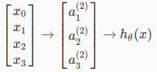

# Week 4: Neural network detail

## Motivation

As you can see in the example of a NN (`simple_nn.md`), NN is simpler, compared to non-linear Logistic Regression.

Without NN, we need to add many features to Logistic Regression to make it non-linear to be able can classify that simple dataset.

More over, for example of recognizing an image with size 20x20, which will introduce 400 features.  
Standard hypothesis function and optimization will be very slow.  

=> Neural network: the idea to split into layers, mimic brain.

## Model represention

Simplified model representation with 1 hidden layer:  
  
Here we see 3 layers:

- Layer 1: input nodes
- Layer 2: hidden layer
- Layer 3: output

Detail activations:  
  
First 3 rows describe layer 2.  
4th rows describe layer 3 (our ouput).  

To transform from layer j to layer j+1, the parameter (weight) matrix should be:  
  
sj+1 rows and sj + 1 columns  

## Vectorization

Generalize by `z`:  

Input layer `x` can be seemed as layer 1, denoted by a1  

Then we got final hypothesis  
  

## Programming exercise

The problem here is handwritten (number) recognization.  
Training data is list of 20x20 images.  
So, each sample:

- Input has 400 features
- Output has 10 classes

There are 2 parts:

- Regression
- Neural network

For Regression part, we do as before: find theta by gradient descent, apply one-vs-all for each class and predict. Very similar to last week.

For Neural network part, we don't do much, because theta is given.

All we need is use theta to compute activation for each layer, and output result.

Next week will teach how to make neural network.