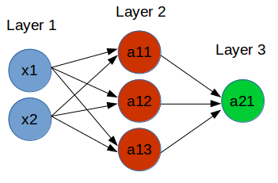

# Week 4: Neural network

Suppose we have a classification problem of this dataset:  


There are 2 features: `x1` and `x2`.  
There are 2 classes: `BLACK` and `YELLOW`.

We have to build a classifier. It's easy to see that we need a non-linear model.

As in the last few weeks, we can build a Logistic Regression and adding high degree features or feature crossing, make model non-linear.

In reality, feature engineering like that can be hard and consumes a lot of time. Neural Network helps to solve it.

By common sense, with 3 lines, we can separate those 2 classes, like this:  


Looking at the plot, we can easily classify a point as YELLOW if it satisfies all these conditions:

- In the left of Line1
- In the right of Line2
- Above of Line3

Now, think of those 3 lines as 3 classifiers. Each take input `x1` and `x2`, and output `true/false` if the condition is met. For example, classifier 1 will output `true` if `x1,x2` in the left and Line1, and vice versa.

Let's encode `true/false` as `1/0`. So at this step, we have 3 classifiers, which outputs `1 or 0`.

Sound familiar? Yes, it's Logistic Regression. We have 3 Logistic Regression classifers here!

Let's group them as Layer 2. Layer 1 is our input `x1` and `x2`.

Now, make Layer 3 - a final classifier that take output at 3 classifiers at Layer 2, and output a final result: `YELLOW` or `BLACK`. It can be a Logistic Regression classifier too, with 3 features input (output from Layer 2).

Got the idea here? Here is the architecture:  


`a11` is the classifier corresponding to Line1.  
`a12` is the classifier corresponding to Line2.  
`a13` is the classifier corresponding to Line3.  
`a21` is the final classifier, which output `YELLOW` or `BLACK`.  

And we call it Neural Network.

I took this explanation idea from [this article](https://medium.com/@vivek.yadav/how-neural-networks-learn-nonlinear-functions-and-classify-linearly-non-separable-data-22328e7e5be1) .

## Playground

Take a look at folder `simple-nn` for demonstration of this classifier.

In the file `predefined_nn.m`, I make a NN with precalculated parameters:

Layer 2 with 3 neurons:

```html
theta11 = [-5 -1.55 1];
theta12 = [-5 1.55 1];
theta13 = [2.5 -0.05 1];
```

In Layer 2, those parameters can be calculated by hand, looking at the plot.

Layer 3 with 1 neurons:

```html
theta21 = [11.049076 29.623975 28.734228 -30.660159]
```

For Layer 3 parameters, I use Logistic Regression to train a model take input from Layer 2. See the block commented code.

And finally, calculate accuracy of final layer. Here base on the output (which is from sigmoid function), I choose threshold 0.5 to classify the output.

```html
predictions = a31 > 0.5;
```