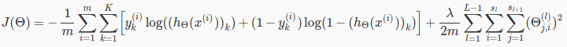
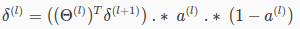
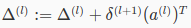
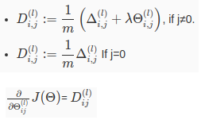

# Neural network - Cost function

This is NN cost function:  
  
`K`: number of output classes  
`L`: number of layers  
`s_l`: number of units in layer `l`  

Very similar to regression cost function, but instead of compute the cost of single class,
we sum total cost in all output classes (`K` classes).

Our goal is still the same: find `theta` to minimize cost `J`.

# Backpropagation

Similar to Gradient Descent, we also want to calculate the Gradient (partial derivative)
of `J`. Using method backpropagation.

In regression, we only have 1 layer, so single `theta` can be easily calculated just in single calculation of the cost between final `h` and `y`.

In NN, we have multiple layers, so multiple `theta`, and we have to calculate cost at each
layer, to optimize each `theta`.

## Error at each layer

We call `delta` is error at each layer unit.  
`delta_L` at last layer (output) is easy to get: `h(x) - y`  
Generalized, `delta` at any last layer can be calculated by Calculus's [**Chain rule**](https://en.wikipedia.org/wiki/Chain_rule):  

## Error at each layer for all examples

Accumulated in all examples:  

## Gradient at layer `l`

