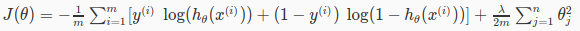
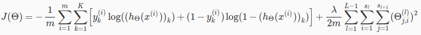
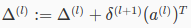
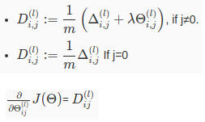

# Week 5 - Train a Neural Network

We formulated a NN model in week 4. Now talking about Cost function.

## Cost function

Recall the cost function for regularized logistic regression was:  

NN is actual the combination of multiple Logisitic Regression classifiers, with multiple output. So the NN cost function is:  
  
`K`: number of output classes  
`L`: number of layers  
`s_l`: number of units in layer `l`  

Very similar to regression cost function.

The first term sum all cost of `K` output classes.  
The second term is regularization, we sum all `theta` in the network.

Our goal is still the same: find `theta` to minimize cost `J`.

## Backpropagation concept

Similar to Gradient Descent, we also want to calculate the Gradient (partial derivative) of `J`. Using method backpropagation.

In regression, we only have 1 layer, so single `theta` can be easily calculated just in single calculation of the cost between final `h` and `y`.

In NN, we have multiple layers, so multiple `theta`, and we have to calculate cost at eachlayer, to optimize each `theta`.

### Error at each layer

We call `delta` is error at each layer unit.  
`delta_L` at last layer (output) is easy to get: `h(x) - y`  
Generalized, `delta` at any layer can be calculated by Calculus's [**Chain rule**](https://en.wikipedia.org/wiki/Chain_rule):  

### Error at each layer for all examples

Accumulated in all examples:  

### Gradient at layer `l`

Now we have the gradient of cost function. We can apply Gradient Descent and train model.

## Training steps

### Initialize theta

We need the initial theta to feed to our training process, just as before in Logistic Regression.

But, in NN, initializing all theta weights to zero does not work. Because when we backpropagate, all nodes will update to the same value repeatedly.  
Instead, we randomize the initial value of all theta in a small range, e.g. [-0.1, 0.1]

### Backpropagation

First, implement forward propagation.  
Implement cost function and backpropagation to compute gradient of cost function.  
At first iteration, implement Gradient Checking to confirm backpropagation works. Then disable Gradient Checking.  
Continue with Gradient Descent or any to minimize the cost function and get optimal theta.

## Programming Exercise

Have fun.

## Playground

In week 4, we build a simple NN to classify based on circle dataset, using precalculated parameters (theta).

This time, we use the same dataset, and train a NN by backpropagation. Some code are based on the programming exercise, so get it done first.

Looking at `nn.m`, we setup NN as before:

- Input layer with 2 features
- 1 hidden layer with 3 neurons
- Output layer with 2 classes

First, we initialize random theta.  
Second, use `fmincg` to train NN.  
Finally, make prediction and calculate accuracy.
