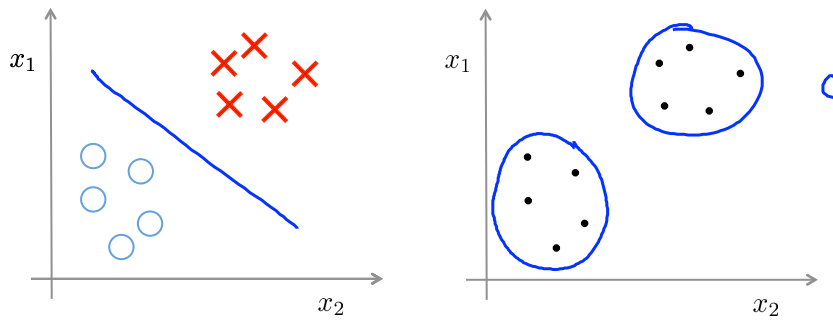
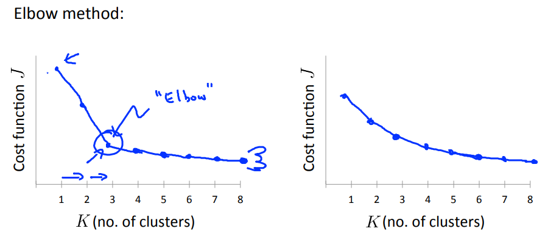

# Week 8 - Unsupervised Learning

## Supervised Learning vs Unsupervised Learning



In Unsupervised Learning, there is no output `y` in training examples.  
We don't have to predict the output an example.  
Instead, we group examples into clusters.

## K-means

Why the name: we will find the `means` of `K` clusters.  
The `mean` of a cluster is called the cluster centroid.

### K-means algorithms

- Randomly initiate the centroids for `K` clusters.  
- Repeat  
  - For each point: Find the closest centroid and assign that point to that cluster.  
  - For each cluster: Find the mean position of belonging points. This is the new centroid of that cluster.  
  - Until all centroids are stable.  

### Choosing K



## Dimension reduction

- Data compression  
- Easy to visulize (2D 3D)

### Principal Component Analysis (PCA)

Use `svd` function:

```
Sigma = X' * X / m

[U,S,V] = svd(Sigma)

z = U_reduce' * X
```

### Reconstruct from reduced dimension

Recover approximation from z:  
`x_rec = U_reduce * z`

### Choosing good K

Choose k to be smallest value so that the difference between `X` and `x_rec` is very small

### Applications

Should NOT use PCA to reduce dimension to prevent overfit! Use regularization first.