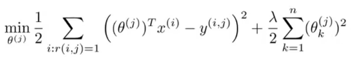

# Week 9 - Anomaly detection

Detect outliers

## Gaussian distribution

Given set of input X, find the Gaussian distribution parameters `mean` and `variance`.  
Use this function to find the probability of new input to be consider as anomaly.  

## Anomaly Detection vs Supervised Learning

## Recommender system

Given the rating matrix like this:  

We have to predict the rating masked as ?.  
`x1` and `x2` is features, derived from the nature of movies. Here number of features is `n=2`.

For each user, we have a `theta` (calculated by some algorithms), then we can predict the rating: `rating = theta' * X`  

### Find theta

Use linear regression, with input X and output Y is rating (ignore non-exist rating). This formula is for 1 user `j`

For all users:

## Colaborative filtering

In this case, the features X is not given. We have to find both `theta` and `X`.

We first initialize random X, then find theta, and use that theta to find X and repeat.

Further, we can use gradient descent (or other algorithms) to optimize both `theta` and `X` at the same time:

